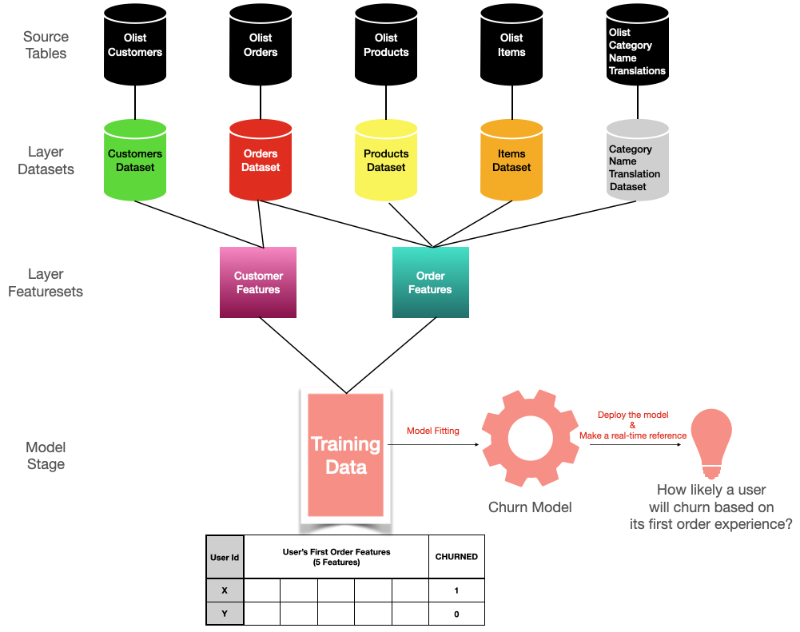

# Onboarding Project: Churn Prediction

## Install and run
To check out the Tutorial I, run:
```commandline
1. layer clone https://github.com/layerml/onboarding-project.git
2. cd onboarding-project/onboarding-project-base
```

To build the project:
```commandline
layer start
```

## Onboarding Project Directory Tree
```
.
├── .layer
├── data
│   ├── category_name_translation_dataset  
│   │   ├── dataset.yaml         
│   ├── customers_dataset  
│   │   ├── dataset.yaml
│   ├── items_dataset  
│   │   ├── dataset.yaml
│   ├── orders_dataset  
│   │   ├── dataset.yaml
│   ├── payments_dataset  
│   │   ├── dataset.yaml
│   ├── products_dataset  
│   │   ├── dataset.yaml
├── features
│   ├── customer_features
│   │   ├── first_order_id.py  
│   │   ├── first_order_timestamp.py
│   │   ├── ordered_again.py
│   │   ├── dataset.yaml
│   │   ├── requirements.txt         
│   ├── order_features 
│   │   ├── days_between_delivery_and_purchase.py  
│   │   ├── days_between_estimate_actual_delivery.py
│   │   ├── main_product_category.py
│   │   ├── total_freight.py
│   │   ├── total_payment.py
│   │   ├── dataset.yaml
│   │   ├── requirements.txt  
├── models
│   └── churn_model
│       ├── model.py              
│       ├── model.yaml                
│       └── requirements.txt   
└── README.md
```
## Project Description

- **General Info:**
  - Total of 6 source Datasets used
  - Total of 2 Featuresets are generated
    - *customer_features*: Total of 3 user features are generated
    - *order_features*: Total of 5 order features are generated


- **Goal:** Predict churn for the Brazilian e-commerce company-Olist's customers based on their first order experience


- **Definition of churn:** If a customer is not going to order again in the next 365 days right after its first order

  - Reasoning: Since we only have customers' data in the OLIST's Kaggle datasets who have ordered at least once before, we formulate the problem accordingly.
  - Target Variable: CHURNED
    - if `ordered_again` _[from customer_features]_ is 1, then 0
    - else, then 1


- **Feature Descriptions:**
  - After building this Layer Project, go to the Layer Web UI and see all the feature descriptions in the Data Catalog


- **Source Tables Descriptions:**
  - See the README here: https://github.com/layerml/onboarding-project
  - Visit the Kaggle page: https://www.kaggle.com/olistbr/brazilian-ecommerce


- **Project Big Picture:**
